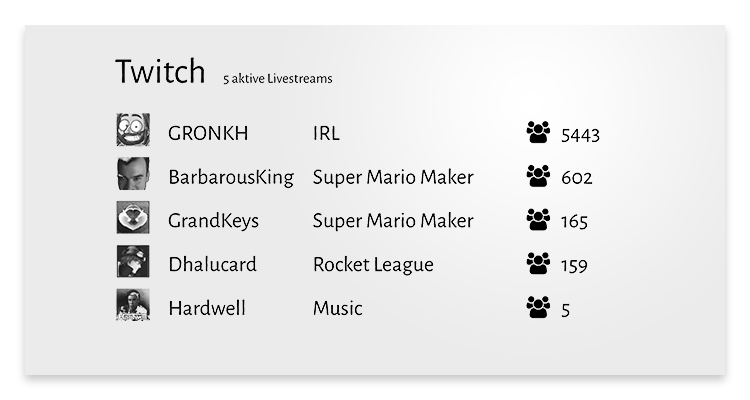

# mirrOS Twitch Modul

Das Twitch-Modul zeigt aktive Twitch Livestreams auf deinem Glancr an.

## Voraussetzungen

* Twitch-Account
* Twitch Client ID ([zum Tutorial](https://glancr.de/tutorials/das-twitch-modul-konfigurieren/))
* Raspberry mit installiertem [mirrOS](https://glancr.de/mirr-os/)

## Download

Du kannst dir [hier](https://glancr.de/module/unterhaltung/twitch/) die neuste Version des Moduls herunterladen.  
Die Modul-Updates werden direkt via mirrOS-Backend installiert.

## Das Modul in Aktion

## Weitere Informationen
* [Twitch-Modul](https://glancr.de/module/unterhaltung/twitch/)
* [Glancr](https://glancr.de)
* [mirrOS](https://glancr.de/mirr-os)

## Andere Module

Besuche meine Entwicklerseite und schau dir meine anderen Module an: 
[Marco Roth auf glancr.de](https://glancr.de/entwickler/marco-roth/)
